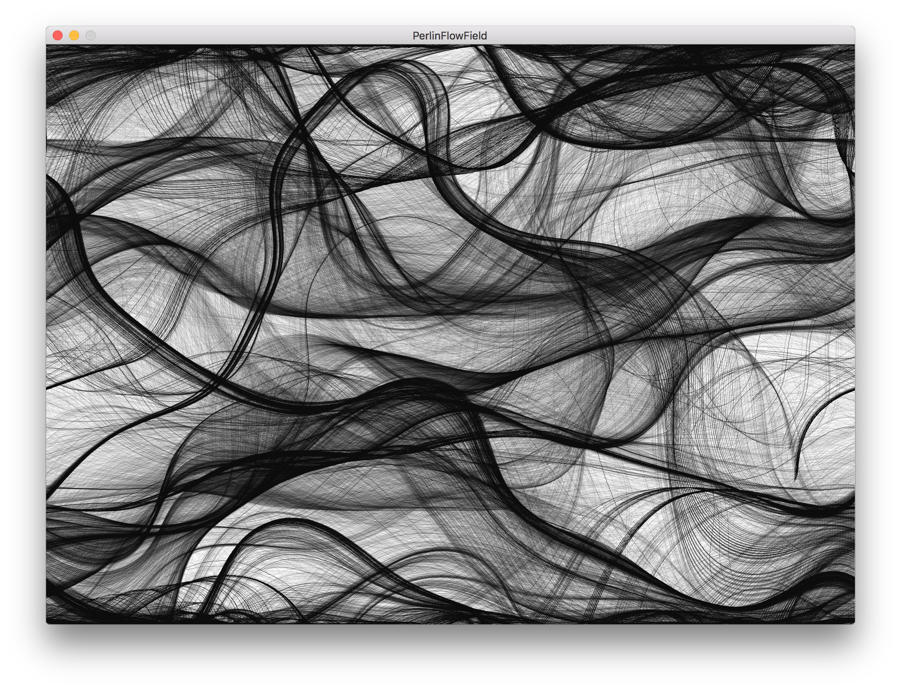
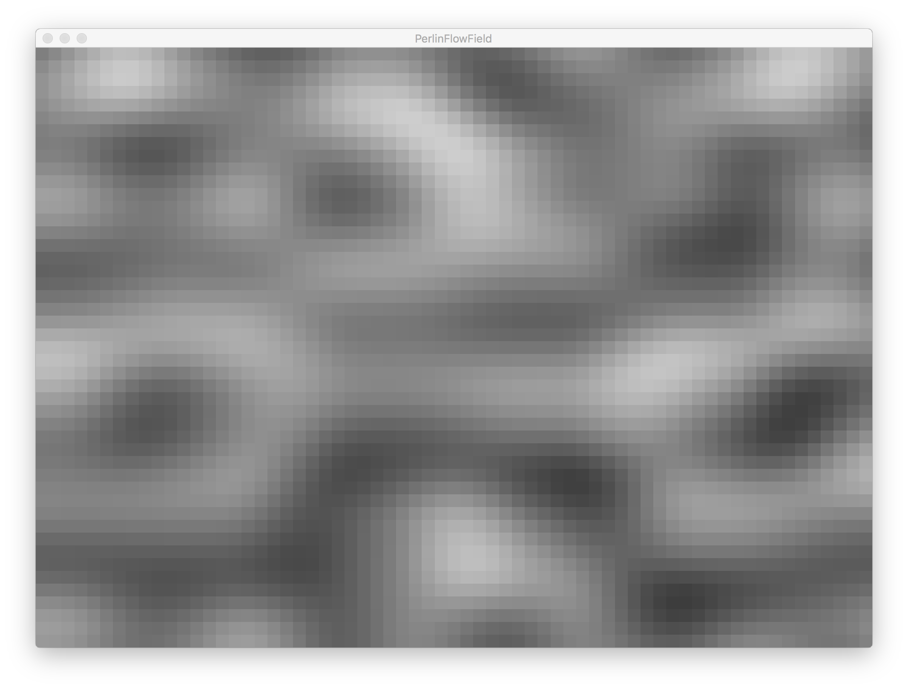
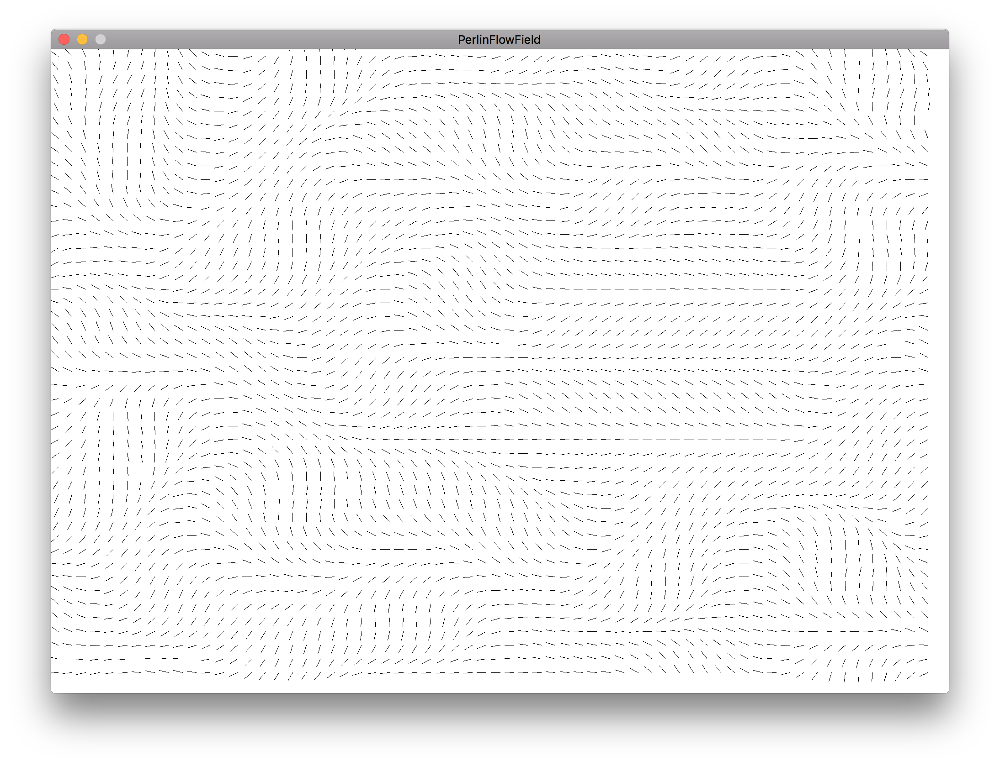

# PerlinFlowField

A flow field generated using 3d perlin noise.
The flow field is then used to control the position of particles on the screen.

### Controls

"space" key to move to the next frame buffer
"c" key to clear the flow field effect frame buffer when it is selecte

